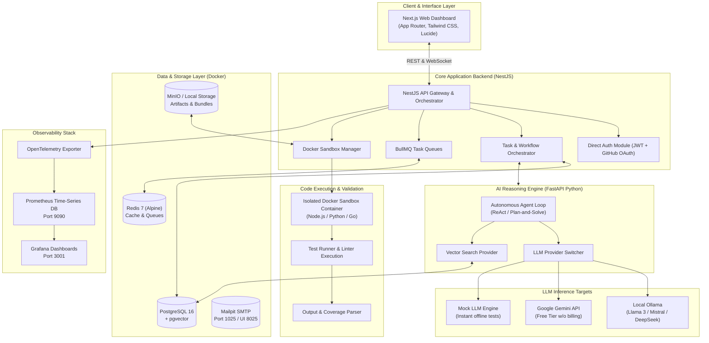

# DevPilot System Architecture

DevPilot is an autonomous AI developer platform providing agentic code planning, generation, review, isolated sandbox testing, and workflow automation.

The entire architecture is designed with **modular provider abstractions** allowing developers to switch between local open-source utilities and cloud services without altering core business logic.

---

## 1. High-Level Architecture Diagram



---

## 2. Zero-Cost Fallback Guarantee

If run without external internet or third-party cloud credentials, the system automatically uses the following fallback chain:

```
[Incoming User Task: "Create auth middleware with rate limiting"]
                        │
                        ▼
   [LLM Provider Resolution: Check LLM_PROVIDER]
   ├── "ollama" ───────► Connects to http://localhost:11434 (free local model)
   ├── "gemini" ───────► Connects to Gemini free tier (optional)
   └── "mock" ─────────► Deterministic synthetic code generator (Zero GPU / Zero RAM)
                        │
                        ▼
   [Vector Resolution: Check VECTOR_PROVIDER]
   ├── "pgvector" ─────► Executes cosine similarity on local PostgreSQL
   ├── "qdrant" ───────► Queries local Qdrant container
   └── "memory" ───────► In-memory numpy cosine similarity fallback
                        │
                        ▼
   [Code Sandbox Execution: Check Docker availability]
   ├── Docker Active ──► Runs command in unprivileged ephemeral container
   └── Host Mode ──────► Runs command in isolated temp folder with timeout
                        │
                        ▼
   [Verification: Tests pass, coverage emitted, artifacts stored locally]
```

---

## 3. Provider Abstraction Contracts

### TypeScript (NestJS Core API)

```typescript
// LLM Provider Interface
export interface LLMResponse {
  content: string;
  usage?: { promptTokens: number; completionTokens: number };
  model: string;
}

export interface ILLMProvider {
  name: string;
  generate(prompt: string, systemPrompt?: string): Promise<LLMResponse>;
  stream(prompt: string, onChunk: (chunk: string) => void): Promise<void>;
}

// Vector Provider Interface
export interface VectorSearchResult {
  id: string;
  score: number;
  metadata: Record<string, any>;
  content: string;
}

export interface IVectorProvider {
  name: string;
  createIndex(collection: string, dimension: number): Promise<void>;
  upsert(collection: string, vectors: { id: string; embedding: number[]; content: string; metadata?: any }[]): Promise<void>;
  search(collection: string, queryEmbedding: number[], topK: number): Promise<VectorSearchResult[]>;
}

// Storage Provider Interface
export interface IStorageProvider {
  name: string;
  upload(key: string, fileBuffer: Buffer, mimeType: string): Promise<string>;
  download(key: string): Promise<Buffer>;
  delete(key: string): Promise<void>;
  getUrl(key: string): string;
}

// Email Provider Interface
export interface IEmailProvider {
  name: string;
  sendEmail(to: string, subject: string, html: string): Promise<void>;
}
```

### Python (FastAPI AI Service)

```python
from abc import ABC, abstractmethod
from typing import Dict, Any, List, Optional

class BaseLLMProvider(ABC):
    @abstractmethod
    async def generate(self, prompt: str, system_prompt: Optional[str] = None, **kwargs) -> Dict[str, Any]:
        """Generate a completion from the configured model."""
        pass

    @abstractmethod
    async def get_embedding(self, text: str) -> List[float]:
        """Generate a dense embedding vector."""
        pass
```

---

## 4. Sandbox Isolation Architecture

When an agent generates code or tests, it must never execute directly in the production API host process. Instead:

1. **Volume Mount**: A temporary workspace is mounted to `/workspace` inside an ephemeral container.
2. **Resource Constraints**:
   - Memory limit: 512MB
   - CPU quota: 1.0 core
   - Network isolation: Disabled (`--network none`) or restricted to local mirror.
   - User privileges: Non-root (`1001:1001`).
   - Time-to-Live (TTL): 30 seconds max execution time.
3. **Telemetry & Artifacts**:
   - `stdout` and `stderr` streams are captured in real-time.
   - Exit code is returned to the Agent ReAct loop for iterative debugging.
